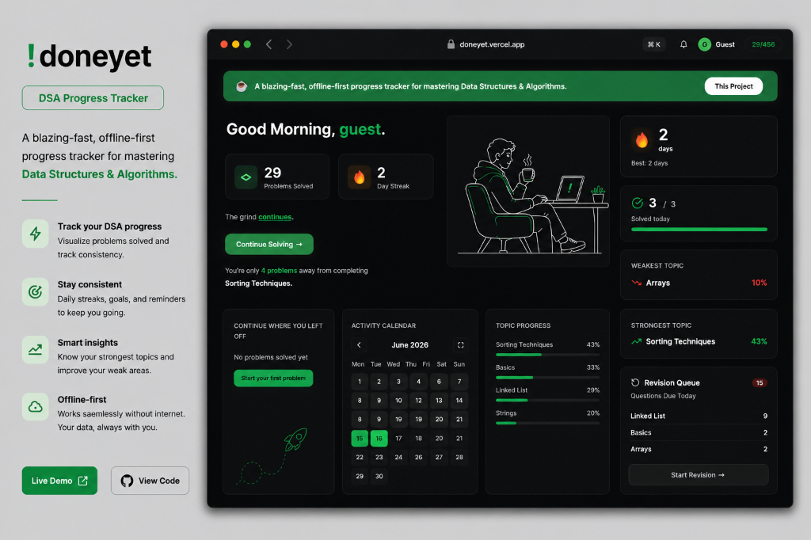

# !doneyet 🚀

<p align="left">
  
  
</p>

## Overview 👀



* 📊 **Intelligent Dashboard:** A beautifully designed, fully responsive dark-mode interface tracking your overall DSA progress.
* 🧠 **Spaced Repetition Engine:** An automated revision queue that ensures concepts stick in your long-term memory.
* 🔥 **Consistency Heatmap:** A GitHub-style contribution graph and daily streak tracking to keep you motivated.
* 📂 **Comprehensive Topic Library:** Granular tracking across 20+ crucial DSA topics featuring custom iconography.
* ⚡ **Offline-First Architecture:** Built to be blazingly fast. All data is managed locally first and synced silently to Firebase.
* 📱 **Mobile First Design:** Works flawlessly whether you're on your desktop or your smartphone.

## Dependencies 🗃️
* **React** – Frontend Framework
* **Vite** – Build Tool
* **Firebase** – Cloud Database Sync
* **Zustand** – State Management

## Deployed Website 🌎

https://doneyet.vercel.app/

## Run Locally 💻

Clone the repository

For Windows (Git Bash) / Linux (Terminal):

```bash
git clone https://github.com/alok615/NOT_DONE_YET.git
```

Change directory

```bash
cd NOT_DONE_YET
```

Install dependencies

```bash
npm install
```

Start the development server

```bash
npm run dev
```

!doneyet runs on port 5173 of your local machine.

## How to Contribute 💥
* Take a look at the existing Issues or create your own issues.
* Wait for the issue to be assigned to you, after which you can start working on it.
* Fork the repository and create a branch for the issue you are working on.
* Create a Pull Request, which will be promptly reviewed and suggestions will be added to improve it.
* Add screenshots to help explain what the code is all about.

## Developed By 🧑‍💻


**Alok Kumar Singh**

[LinkedIn](https://www.linkedin.com/in/aloksingh74) | [Email](mailto:aloksingh18487@gmail.com)
